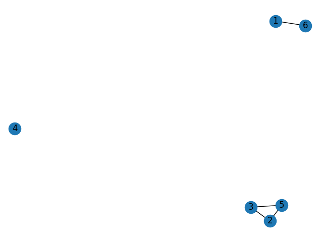
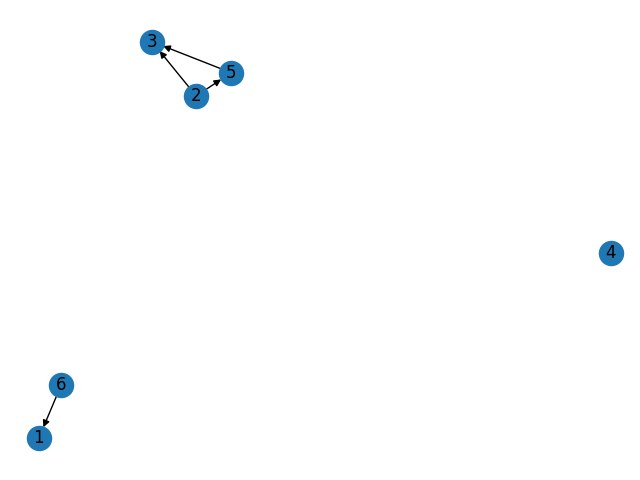

1. Define:

	(a) Subgraph
	
	**R:** Um subgraph como o próprio nome já diz, é um subgráfico de outro gráfico. Por exemplo, eu posso ter um gráfico G que tem 10 nós, e extrair dele 5 nós de interesse criando assim um subgráfico G_Sub.
	
	(b) Bipartite graph.
	
	**R:** Um gráfico bipartido é um gráfico particionado em dois conjuntos A e B, tais que os nós da partição A devem ter arestas com extremidades em B.
	
	(c) Hamiltonian graph
	
	**R:** Em resumo representa a ideia que existe um caminho que permite passar por todos os vértices de um grafo G, sem repetir nenhum deles.
	
	(d) Eulerian graph.
	
	**R:** Semelhante ao hamiltonian graph, porém nesse caso o caminho percorrido pode apenas passar apenas uma única vez por cada aresta.

2. Describe how a breadth-first search algorithm works.

	**R:** Basicamente é uma consulta baseada no menor número de arestas possíveis para ligar o nó A com o nó B. Em outras palavras qual o menor caminho saindo de A e chegar em B passando pelo menor número de vértices. Isso significa que se não existe um caminho direto entre A e B, a busca é feita por todos os vizinhos de A, se algum dos vizinhos de A tem um link direto para B, então achamos o menor caminho, só depois de verificar que não existe um link de qualquer vizinho de A diretamente para B é que vamos consultar os vizinhos dos vizinhos de A, isso se repete até encontrar um link com B.

3. How many edges does a complete graph with n vertices have? What about a complete directed graph with n vertices?

	**R:** O número de arestas de um grafo completo com n vértices é igual a (n(n-1))/2. Já no grafo direcionado é igual a n(n-1).

4. What are isomorphic graphs? Draw an example.

	**R:** São grafos com o mesmo número de vértices, arestas e também a mesma conectividade de arestas.
	Exemplo:
	VG = {1,2,3,4} e AG = {(1,2),(3,4)}
	VH = {a,b,c,d} e AH = {(a,d),(b,c)}
5. Calculate the degree of the nodes for both node types in the bipartite adjacency matrix from the figure below. Find the isolated node(s).
	
	**R:** G1 = 2, G2 = 3, G3 = 4, G4 = 2, G5 = 3, G6 = 1, G7 = 0, G8 = 2, G9 = 1
6. Given the digraph G = (V, E) where V = {M, N, O, P, Q, R, S} and
E ={(M, S), (N, O), (P, R), (N, S), (O, M), (N, Q), (O, M), (P, P), (S, M), (O, N),  (S, M), (N, R), (P, M), (M, S)}

	(a) Specify, if any, a simple path from vertex M to vertex S.
	
	**R:** Existe uma aresta que permite um link direto entre os nós M e S representado pelo par ordenado (M, S).

	(b) Specify, if any, a simple cycle, involving at least 4 nodes.
	
	**R:** N -> O -> M -> S -> N

	(c) Is the digraph connected or not connected?
	
	**R:** É conectado.

	(d) What is the degree of vertices N and R.
	
	**R:** Grau de N igual a 5. Grau de R igual a 2.
	
	(e) Represent the digraph using adjacency list representation.
	
	**R:** [('M', 'S'), ('N', 'O'), ('N', 'S'), ('N', 'Q'), ('N', 'R'), ('O', 'M'), ('O', 'N'), ('P', 'R'), ('P', 'P'), ('P', 'M'), ('S', 'M')]

	(f) Represent the digraph using adjacency matrix representation.
	
	**R:**
	
		    M  N  O  P  Q  R  S
	     M  0  0  0  0  0  0  1
	     N  0  0  1  0  1  1  1
	     O  1  1  0  0  0  0  0
	     P  1  0  0  1  0  1  0
	     Q  0  0  0  0  0  0  0
	     R  0  0  0  0  0  0  0
	     S  1  0  0  0  0  0  0
	     
7. Draw the undirected and directed versions of the graph G(V, E), where V = {1, 2, 3, 4, 5, 6} and E = {(2, 5), (6, 1), (5, 3), (2, 3)}.
	
	**R:** <a href="./source/q_7.py" target="_blank">Código-fonte</a>
	
	Undirected graph
	
	
	
	Directed graph
	
	
	
8. How many edges does a graph have 3 vertices of degree 3 and one vertex of degree 5?
	
	**R:**  ((3*3)+(1*5))/2 = 7
